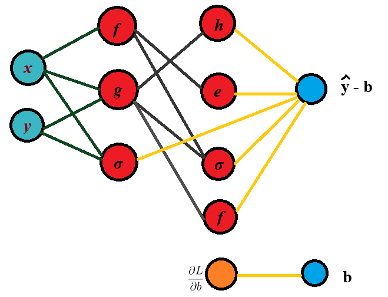
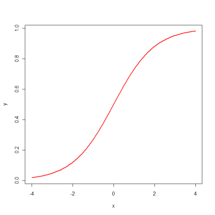
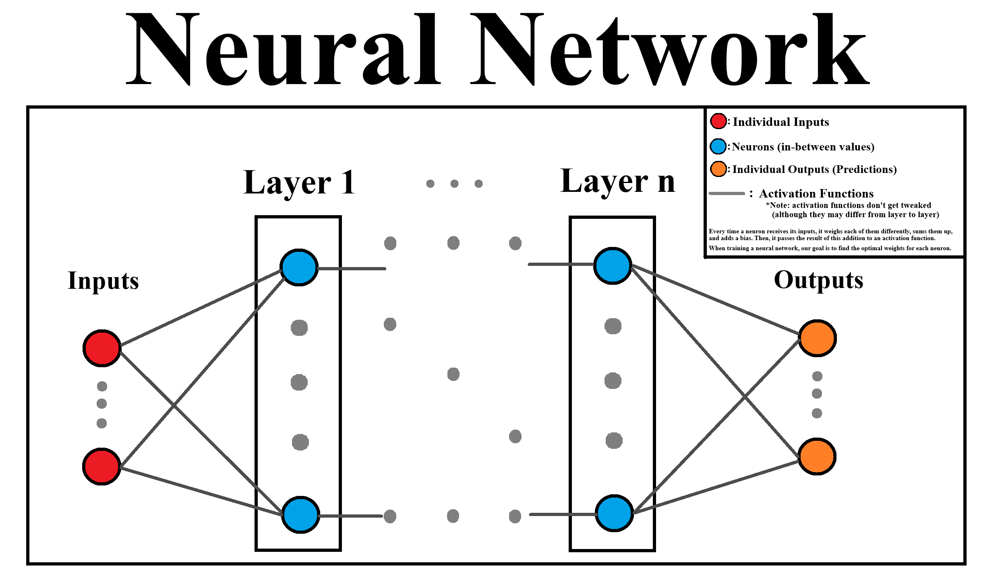

# Backpropagation


🚧 In  Progress
To-do:

- Installation steps
- Test/Demo/etc. then wrap up !!

## Table of Contents

- [Backpropagation](#backpropagation)
  - [Table of Contents](#table-of-contents)
  - [Motivation](#motivation)
  - [Mathematical Foundation \& Theory](#mathematical-foundation--theory)
    - [Neural Network Basics](#neural-network-basics)
    - [Algorithm](#algorithm)
  - [Project Structure](#project-structure)
  - [Installation \& Usage](#installation--usage)
    - [Prerequisites](#prerequisites)
    - [Setup](#setup)
    - [Usage](#usage)
  - [Bibliography](#bibliography)
  - [License](#license)

## Motivation

Imagine we're trying to fit a multi-layered model to data. In real life, we may start to nest multiple functions together. These functions need to be optimized. If we start with normal gradient descent, we can achieve this, but it will be very expensive computationally. Backpropagation is a numerical technique applied to gradient (or [other](https://github.com/intelligent-username/gradient-descent?tab=readme-ov-file#3adaptive) optimization methods) that makes this process practical.

## Mathematical Foundation & Theory

At its core, backpropagation takes reverse-mode differentiation and uses dynamic programming to make the calculation/storing process more efficient.

Automatic differentiation is among the simplest numerical methods in machine learning. Simply put when we have a 'nest' of functions $\hat{y} = f_n(f_{n-1}(...f_1(x))) + b$, and we want to find $\frac{d \hat{y}}{d x}$, we can use the chain rule, which gives:

$$
\frac{d \hat{y}}{d x} = \frac{d \hat{f_n}}{d f_{n-1}} \cdot \frac{d f_{n-1}}{d f_{n-2}} \cdots \frac{d f_1}{d x}
$$

In autodifferentiation, we read each partial derivative and multiply to get the final result. This can be done in two ways: **forward mode** and **reverse mode**.

Forward mode is when we read 'into' the function from the outer layers inwards, calculating the values of the functions and derivatives as we go. Each intermediate derivative is computed alongside the function value.

So, we first find $f_1(x)$ and $\frac{d f_1}{d x}$, then use those to find $f_2(f_1(x))$ and $\frac{d f_2}{d f_1}$, and so forth.

In reverse mode, however, we calculate the values of the functions as we work 'inwards', and then we propagate back out, finding the derivatives with the pre-computed function values. We do the same function evaluations first, cache results, and propagate sensitivities backward to compute derivatives.

So, we first find $f_n(...(f_1(x)))$, then $f_{n-1}(...f_1(x))$, and so forth as we propagate inwards. Then, we cache these results start finding $\frac{d \hat{y}}{d f_n}$ by propagating backwards to find $\frac{d f_n}{d f_{n-1}}$, and so forth.

In backpropagation, we use reverse mode since we usually have more neurons than outputs.

It's important to understand that a neural network is just terminology that is meant to help us intuit *how* the nested functions work. It works the same as any other optimization process, with training being a crucial part.

### Neural Network Basics

Imagine we have some data that follows the trend of the following equation:

$$\hat{y}(x,y) = f(g(x,y)) + h(g(x,y)) + e^{f(x)} + \sigma(x,y) + \sigma((g(x,y), f(x))) + b$$

Which can be visualized as a series of layers:



In real life, we're not just *given* equations, so we use neural networks to estimate what this function is going to be, based on just the features (inputs) and the labels (outputs).

Some terminology:

- **Neural network**: the entire composite function.
- **Layer**: the set of neurons at the same 'depth' of the network.
- **Neuron**: a single unit within the neural network that applies a non-linear activation and a weighted sum. Sometimes called a node. They take in some number of inputs, apply weights and biases, and pass the result to an activation function to get their result.
- **Activation functions**: functions that determine the output of a neuron by applying a non-linear transformation to the input. Without them, we would just be composing a bunch of linear functions, which would be equivalent to a single linear function, thus regression to simple regression tasks instead of actually modelling complex curves.



- **Perceptron**: Computes $y = f(mw+ b)$ and maps an input to either $0$ or $1$, serving as a binary classifier. These are rarely used nowadays, differentiable activation functions at or near the output are preferred instead.

Types of neural networks:

- **Dense**: in a dense neural network, every neuron in one layer is connected to every neuron in the next layer. All connections have a weight.
- **Sparse**: not every neuron is connected to every other neuron (in other words, some weights are zero).
&nbsp; - **Convolutional**: outputs are connected to a small patch of inputs.
&nbsp; - **Recurrent**: layers have connections looping back to previous layers, like an FSM.

Have a look at this beautiful diagram for a summary:



Now, we are ready to create the model. Every time a neuron receives its inputs, it weighs them and adds a bias. Then, it passes the result of this addition to an optimization function, creating its output which is passed on to the next layer(s). When training a neural network, our goal is to find the best weights for making accurate predictions. We can turn to gradient descent, evolution algorithms, or other optimization methods to do this. In this project, I will focus on gradient descent.

When optimizing the weights between neurons through gradient descent, we can make many tweaks for the sake of efficiency and accuracy, but the biggest hurdle is the time it takes to compute the gradients. If we have a deep neural network with many layers and parameters, calculating the gradients is the limiting factor. This is why backpropagation is so important. However, at the same time, backpropagation isn't *strictly* necessary for making a neural network, though it is the most convenient way when using gradient descent.

### Algorithm

Backpropagation follows a simple mechanical process, based around gradient descent.

$$
w_{i+1} = w_i - \eta \frac{\partial L}{\partial w_i}
$$

In steps, this is:

1. **Initiate**: start with a neural network of weights and biases
2. **'Loss Term'**: start computing the loss at the current point and its derivative to find the direction to move.
3. **Forward Pass**: compute the output of the network by evaluating each neuron from left to right, caching intermediate values.
4. **Backward Pass**: compute the derivative of the loss with respect to every parameter by applying the chain rule in reverse. Start from $\frac{\partial L}{\partial \hat{y}}$ and move backward through each layer, using cached values from the forward pass.
5. **Gradient Aggregation**: combine the local derivatives from each neuron to get the updated gradients.
6. **Parameter Update**: once all partial gradients are known, multiply by the learning rate and adjust the weights and biases.
7. **Iterate**: continue until convergence criteria are met (for example, predictions are very [similar](https://www.github.com/intelligent-username/Similarity-Metrics) to labels).

---

## Project Structure

```md
Backpropogation/
├── nn/
│   ├── network.py          # Actual Neural Network Structure, composed of layers
│   ├── layer.py            # Layers, which are just matrices of weights that store past activations (store the information necessary for the math)
│   ├── activations.py      # Activation functions & their derivatives
│   ├── loss.py             # Loss functions & their derivatives
│   └── gd.py               # Gradient Descent
├── utils/
│   ├── loader.py           # Preprocessing data
│   ├── metrics.py          # Return accuracy, specificity, and precision to evaluate the model.
│   └── visualizer.py       # For visualizing the training
├── data/                   # The datasets used in the demos
├── tests/                  # Tests to ensure nothing is broken
```

## Installation & Usage

### Prerequisites

- Git
- Python 3.80 or higher
- Pip/Conda

### Setup

1. **Clone the repository from GitHub**:

    ```bash
    git clone https://github.com/intelligent-username/Backpropogation.git
    cd Backpropogation
    ```

2. **Install dependencies**:

    ```bash
    # Create and activate a virtual environment (optional)
    python -m venv venv
    source venv/bin/activate  # On Windows, use `venv\Scripts\activate`

    # Install the required packages
    pip install -r requirements.txt
    ```

### Usage

To use the neural network, you can import the `NeuralNetwork` class, define your layers and activations, and then train it on your data.

Here's a quick example:

```python
from nn.network import NeuralNetwork
from nn.layer import Layer
from nn.activations import tanh, tanh_prime
from nn.loss import mse, mse_prime
from nn.gd import fit

# 1. Define your network architecture
net = NeuralNetwork(loss=mse, loss_derivative=mse_prime)
net.add_layer(Layer(2, 3, tanh, tanh_prime))
net.add_layer(Layer(3, 1, tanh, tanh_prime))

# 2. Load your data (X_train, y_train)

# 3. Train the network
fit(net, X_train, y_train, epochs=1000, learning_rate=0.01)

# 4. Make predictions
# predictions = net.predict(X_test)
```

## Bibliography

So far, the demos make use of 1 dataset.

- Cortez, Paulo. "Student Performance." UCI Machine Learning Repository, 2008, [https://doi.org/10.24432/C5TG7T](https://doi.org/10.24432/C5TG7T).
- [Digits](data/digits) dataset is public domain. [https://www.kaggle.com/datasets/aquibiqbal/digits-09](https://www.kaggle.com/datasets/aquibiqbal/digits-09)

## License

This project is distributed under the [MIT License](LICENSE).
