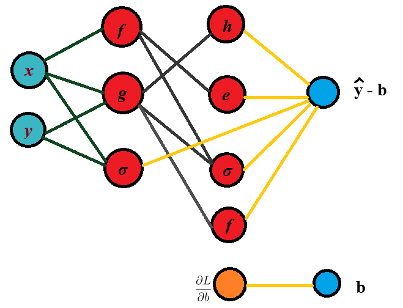

# Backpropagation

🚧 In  Progress
To-do:

- Implement clearly via code
- Installation steps
- Test/Demo/etc. then wrap up !!

## Table of Contents

- [Backpropagation](#backpropagation)
  - [Table of Contents](#table-of-contents)
  - [Motivation](#motivation)
  - [Mathematical Foundation \& Theory](#mathematical-foundation--theory)
    - [Neural Network Basics](#neural-network-basics)
    - [Algorithm](#algorithm)
  - [Project Structure](#project-structure)
  - [Installation \& Usage](#installation--usage)
    - [Prerequisites](#prerequisites)
    - [Setup](#setup)
    - [Usage](#usage)
  - [License](#license)

## Motivation

Imagine we're trying to fit a multi-layered model to data. In real life, we may start to nest multiple functions together. These functions need to be optimized. If we start with normal gradient descent, we can achieve this, but it will be very expensive computationally. Backpropagation is a numerical technique applied to gradient (or [other](https://github.com/intelligent-username/gradient-descent?tab=readme-ov-file#3adaptive) optimization methods) that makes this process practical.

## Mathematical Foundation & Theory

At its core, backpropogation takes reverse-mode differentiation and uses dynamic programming to make the calculation/storing process more efficient.

Automatic differentiation is among the simplest numerical methods in machine learning. Simply put when we have a 'nest' of functions $\hat{y} = f_n(f_{n-1}(...f_1(x))) + b$, and we want to find $\frac{d \hat{y}}{d x}$, we can use the chain rule, which gives:

$$
\frac{d \hat{y}}{d x} = \frac{d \hat{y}}{d f_n} \cdot \frac{d f_n}{d f_{n-1}} \cdots \frac{d f_1}{d x}
$$

In autodifferentiation, we read each partial derivative and multiply to get the final result. This can be done in two ways: **forward mode** and **reverse mode**.

Forward mode is when we read 'into' the function from the outer layers inwards, calculating the values of the functions and derivatives as we go.

So, we first find $f_1(x)$ and $\frac{d f_1}{d x}$, then use those to find $f_2(f_1(x))$ and $\frac{d f_2}{d f_1}$, and so forth.

Reverse mode, however, we calculate the values of the functions as we work 'inwards', and then we propagate back out, finding the derivatives with the pre-computed function values.

So, we first find $f_n(...(f_1(x)))$, then $f_{n-1}(...f_1(x))$, and so forth as we propagate inwards. Then, we cache these results start finding $\frac{d \hat{y}}{d f_n}$ by propagating backwards to find $\frac{d f_n}{d f_{n-1}}$, and so forth.

In backpropagation, we use reverse mode since we usually have more neurons than outputs.

It's important to understand that a neural network is just terminology that is meant to help us intuit *how* the nested functions work. It works the same as any other optimization process, with training being a crucial part.

### Neural Network Basics

Imagine we have a neural network represented by the equation, $\hat{y}(x,y) = f(g(x,y)) + h(g(x,y)) + e^{f(x)} + \sigma(x,y) + \sigma((g(x,y), f(x))) + b$, it can be visualized as a series of layers:

Some terminology:

- **Neural network**: the entire function, visualized above.
- **Neuron**: a single function within the neural network. Sometimes called a node.
- **Layer**: the set of functions at a given 'depth' of the network.
- **Activation functions**: functions that determine the output of a neuron by applying a non-linear transformation to the input. Often, they map the input to [-1, 1]. Their job is to 'create' complexity that can be learned.
- **Perceptron**: a layer of neurons that map inputs to 0 or 1 based on their conditions. These are the simplest type of activation function, and they are useful for classification. However, these are rarely used as they're hard to optimize. We often turn to differentiable activation functions, such as Sigmoid or ReLU instead.

Now, when finding the optimal parameters for a neural network, we (usually) need to minimize a loss function, which is the measure of our accuracy. Weights are adjusted gradually through gradient descent in order to find the optimal parameters. Of course, we can tweak this process by adding regularization, changing the initial hyperparameters, and the like, but the main issue with this process is the sheer amount of time it takes to train a deep neural network. Imagine if we have 5 parameters and 10 layers. All of a sudden, even drawing the neural network becomes complicated, let alone optimizing its parameters. This is where backpropagation comes in.

### Algorithm

Backpropagation follows a simple mechanical process, based around gradient descent.

$$
w_{i+1} = w_i - \eta \frac{\partial L}{\partial w_i}
$$

In steps, we this is:

1. **Initiate**: start with a neural network of weights and biases
2. **Evaluate a difference term**: start computing the loss at the current point and its derivative to find the direction to move.
3. **Forward pass** – compute the output of the network by evaluating each neuron from left to right, caching intermediate values.
4. **Backward pass** – compute the derivative of the loss with respect to every parameter by applying the chain rule in reverse. Start from $\frac{\partial L}{\partial \hat{y}}$ and move backward through each layer, using cached values from the forward pass.
5. **Gradient aggregation** – combine local derivatives from each neuron to get the gradient for each weight and bias.
6. **Parameter update** – once all partials are known, multiply by the learning rate and adjust the weights and biases.

---

## Project Structure

- folders, files

## Installation & Usage

### Prerequisites

- Git
- Python 3.80 or higher
- Pip/Conda

### Setup

- Clone the repository from GitHub
- Dependencies.

### Usage

- Import the neural network class, define layers and activations.
- Train on your data by calling fit(), watch the loss decrease over epochs.
- Make predictions with predict(), evaluate accuracy on test sets.

## License

This project is distributed under the [MIT License][LICENSE](LICENSE).
